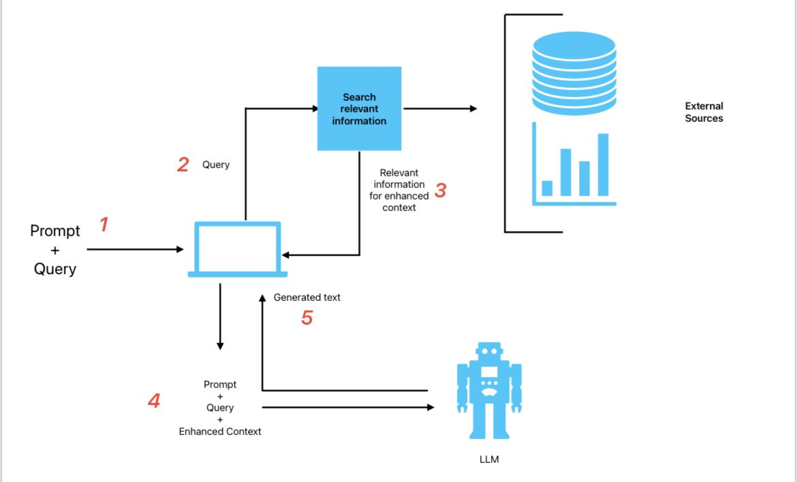

Retreiver Augmented Generation 
=====================================

**Retreiver Augmented Generation** is a method to improve the quality of generated text by using a retriever to select the most relevant context from a external document  for the generation. This repository contains the code for the paper [Retriever Augmented Generation for Knowledge-Intensive NLP Tasks](https://arxiv.org/abs/2109.14794) .

initially, the prompt is passed to the retriever to retrieve the most relevant context from the external document. The retrieved context is then concatenated with the prompt and passed to the generator to generate the final output.

Ollama 
=====================================
Ollama is a library that provides an easy way to use Retriever Augmented Generation in your projects. It is built on top of the Hugging Face Transformers library. Ollama provides a simple API to use the retriever augmented generation method. It allows you to use any retriever and generator model from the Hugging Face model hub.
Ollama is downloadable from the Ollama website: https://ollama.com/

Mistral from Ollama
-------------------------------------
Mistral is large language model trained on a mixture of supervised and unsupervised data. And it is pullable from the Ollama 
To use Mistral from Ollama, you can use the following code:

.. code-block:: bash

    $ ollama pull mistral 

Retriever Augmented Generation from Ollama
========================================================
To use Retriever Augmented Generation from Ollama, we have developed a simple streamlit app that we mentioned in the file 'rag.py'. 
that we will cover in the next section.Where we use the Mistral model as a generator and NomicEmbeddings as a embedding model.
The use of the langchain was to get the embeddings of the documents and the prompt and then pass it to the retriever to get the most relevant context from the document.
The retrieved context is then concatenated with the prompt and passed to the generator to generate the final output.

    
